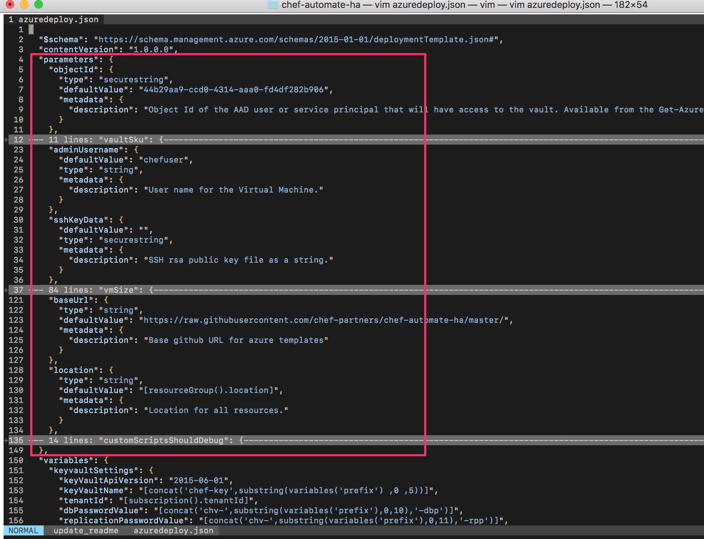

# chef-automate-ha

This Azure Quickstart provides an 'unmanaged' full installation of Chef Server configured for high availability mode and a separate instance of Chef Automate.

Whilst the template is fully functional, it is expected that some customization may be required for your particular environment.  It is aimed at experienced administrators of Chef.

This template uses Azure Key Vault to securely store and transfer secrets between VMs in the solution.

NOTE: This is a fork of one sub-directory called "chef-automate-ha" from Microsoft's own github repository https://github.com/Azure/azure-quickstart-templates.git with a HEAD commit at:

```git
commit f7d7bf4817d5f170543a71c4556e6f33d14749bd
Author: Brian Moore <bmoore@microsoft.com>
Date:   Tue Jun 12 14:16:14 2018 -0500

    Update mainTemplateTests.js
```

## Deployment Outcomes

After deploying this template into your subscription, you will have deployed the reference Chef HA architecture, similar to[https://docs.chef.io/install_server_ha.html](https://docs.chef.io/install_server_ha.html):

- 3x Chef Server frontend VMs behind a load balancer
- 3x Chef Server backend VMs
- 1x Chef Automate VM
- 1x Key Vault

Frontend and Backend will be configured with individual Availability Sets and Premium storage.  All servers use Managed Disk and have configurable VM sizes.  Chef Server will automatically be configured to send run data to Chef Automate.

## Prerequisites

- a local azure client should be installed, either the CLI or Powershell client variations.  To install the the Azure CLI see [these instructions](https://docs.microsoft.com/en-gb/cli/azure/install-azure-cli?view=azure-cli-latest) or to install the Azure Powershell client see [these instructions](https://docs.microsoft.com/en-us/powershell/azure/install-azurerm-ps?view=azurermps-6.3.0)
- The AD identity running this installation should have the **Owner** role on the required Subscription.
- jq should be installed to allow easy parsing of JSON output.  See [installation instructions here](https://stedolan.github.io/jq/download/)

## Installation Instructions

### 1. Ensure you have a valid Service Principal

The template shares information like private keys and passwords between the servers with a Key Vault Resource.  Using an existing service principle credential the template deployment process creates the key vault.  Only a process (or user) using this same service principle can read or write to this key vault.  

If a valid service principle already exists, then skip to the next section; otherwise create a service principle. 

__Using the CLI:__

```bash
stuart@Azure:~$ az ad sp create-for-rbac
Retrying role assignment creation: 1/36
    {
      "appId": "a530c3a0-YOUR-GUID-HERE-21e3d7ede80c",
      "displayName": "azure-cli-2017-05-23-15-28-34",
      "name": "http://azure-cli-2017-05-23-15-28-34",
      "password": "an autogenerated password will appear here",
      "tenant": "a2b2d6bc-YOUR-GUID-HERE-f97a7ac416d7"
    }
```

Use the appId to retrieve further details required via the **az ad sp show --id [appId]** command:

```bash
stuart@Azure:~$ az ad sp show --id a530c3a0-YOUR-GUID-HERE-21e3d7ede80c
    {
        "appId": "a530c3a0-YOUR-GUID-HERE-21e3d7ede80c",
        "displayName": "azure-cli-2017-05-23-15-28-34",
        "objectId": "1a439c30-YOUR-GUID-HERE-9df19f9b1c89",
        "objectType": "ServicePrincipal",
        "servicePrincipalNames": [
          "http://azure-cli-2017-05-23-15-28-34",
          "a530c3a0-YOUR-GUID-HERE-21e3d7ede80c"
        ]
    }
```

__Using the Powershell:__ (TBD)

Once the service principle exists, note the values of **appId**, **objectId** and **password** for later use in the template parameters file.  Keep these values somewhere safe and secure.

### 2. Customize azuredeploy.parameters file

Update **appId, password, objectId, firstname, lastname, emailid** and **organization name** and any other required parameters in the ```azuredeploy.parameters.json``` file.  To get a full list of all available parameters that you can override.  See the "parameters" section in the azuredeploy.json.  One of the parameters is the sshKeyData which, if set with your own public key, will allow you to log onto all VMs with public-key authentication.



### 3. Create Resource Group for solution

__Using the CLI:__
Use the **az group create** command to create a Resource Group in your region, e.g:

```bash
az group create -n chef-automate-ha -l westus
```

__Using the Powershell:__ (TBD)

### 4. Execute the template deployment

Deploy the ARM template using the azure client.

__Using the CLI:__

Use the **az group deployment create** command to deploy the ARM template.  For example, open a terminal, cd into the chef-automate-ha directory and then run:

To run the deployment and wait for the output do the following:

```bash
az group deployment create --template-file 'azuredeploy.json' --parameters 'azuredeploy.parameters.json'
```

To trigger the deployment without waiting for the output add a "--no-wait" parameter.  For example

```bash
az group deployment create --template-file 'azuredeploy.json' --parameters 'azuredeploy.parameters.json'
```

NB: Deployment may take between 30-60 minutes depending on deployment size.

After successful deployment you can see the ```adminusername```, ```chef-server-URL```, ```chef-server-fqdn```, ```keyvaultName```, ```chef-server-weblogin-username```, ```chef-server-weblogin-password```, ```chef-automate-URL```, ```chef-automate-username```, ```chef-automate-password``` and ```chef-automate-fqdn``` for Chef Server, Chef Backend and Chef Automate in the deployment output section of your Resource Group.

Whether the deployment has been triggered with "--no-wait" or not follow the instructions below:

- to get the "provisioningState" of the deployment
- to get the "output" from the deployment

To get the "provisioninState" of the deployment like "Failed", "Succeeded", "Running", etc, run the following command:

```bash
az group deployment show --resource-group <NAME-OF-RESOURCE-GROUP> --name azuredeploy --query properties | jq '.provisioningState'
```

To get the "output" of the deployment, run the following command:

```bash
az group deployment show --resource-group <NAME_OF_RESOURCE_GROUP> --name azuredeploy --query properties.outputs
```

__Using the Powershell:__ (TBD)

## Post-Installation and Verification

If deployment has failed, for some reason:

- check the output from the "az group deployment create..."
- ssh onto one or all of the servers and check the log file in the /tmp directory.  For example, the log file for the automate server will be /tmp/chef-automate-install.sh.log, for the backend /tmp/chef-backend-install.sh.log, for the frontend /tmp/chef-frontend-install.sh.log

If the deployment has succeeded, then you should be able:

- to SSH to the chef server via the ```chef-server-fqdn```
- to view the chef server front page at ```chef-server-URL``` with the username ```chef-server-weblogin-username``` and password ```chef-server-weblogin-password```
- to view the chef automate front page at ```chef-automate-URL``` with the username ```chef-automate-username``` and password ```chef-automate-password```

For more information and to perform additional configuration and customization see all the options available at https://docs.chef.io/install_server_ha.html

## Further information

- To learn more about Chef, visit [learn.chef.io](https://learn.chef.io)
- To learn more about Azure's Cloud Shell visit the azure documentation [here](https://docs.microsoft.com/en-gb/azure/cloud-shell/persisting-shell-storage) and [here](https://docs.microsoft.com/en-gb/azure/cloud-shell/persisting-shell-storage#transfer-local-files-to-cloud-shell) 
- To learn more about how to get output from an azure deployment, visit the [azure documentation](https://docs.microsoft.com/en-us/azure/azure-resource-manager/resource-manager-templates-outputs#define-and-use-output-values).

## Licensing

New users may try the features of this template (including Chef Automate and Chef Backend components) using a trial license for up to 30 days. Contact us at [azuremktplcsales@chef.io](mailto:azuremktplcsales@chef.io) to obtain a full license.

## Contact

Contact the [Partner Engineering team at Chef](mailto:partnereng@chef.io) for queries relating to thie template.

(c) 2018 Chef Software, Inc.
