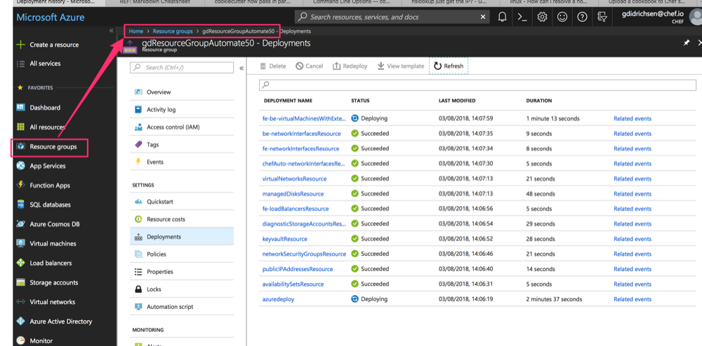

# How to deploy cluster and sample clients

## Overview of the process

In order to begin using the chef automate cluster, to wire in clients, for example, there are a number of high level features that should be understood first:

Deploying the chef-automate-ha cluster

- (1) Deploy the chef-automate-ha cluster.  During the deployment all restricted information like credentials and private keys are stored in a key vault.  Other information like the chefserver username and public DNS are published at the end of a successful deployment in the outputs section of the deployment summary JSON.
- (2a) Log onto azure after a successful deployment of the cluster and get all required infomation:  Query the Key Vault for the credentials and private keys.  Query the azure resource group, in which the cluster is deployed, to get all deployment outputs. 
- (2b) Store locally all the credentials, private keys, and output information.  All of these will be required for the next stage, wiring in client nodes.


Wiring in client nodes:

- (3) Deploy the client(s) to a different azure resource group.
- (4a) Initialize knife so that it can query the chefserver regarding client nodes, upload cookbooks.
- (4b) Use knife to bootstrap the client(s).


## Overview of the directory structure

- At the top level is the chef-automate-ha ARM deployment templates.  
- This document is ./scripts/deploy/README.md
- Beneath ./scripts/deploy is all the code that automates the deployment of the cluster, the configuration of knife, and the setup of a sample chef client node. This will be explained in a later section.

```bash
.
├── azuredeploy.json
├── azuredeploy.parameters.json
├── nested
└── scripts
    └── deploy
        ├── README.md
        ├── src
        │   ├── clients
        │   │   ├── arm
        │   │   │   ├── azuredeploy.json
        │   │   │   ├── azuredeploy.parameters.json
        │   │   │   └── metadata.json
        │   │   ├── deploy.sh
        │   │   └── get_output.sh
        │   ├── cluster
        │   │   ├── deploy.sh
        │   │   ├── get_output.sh
        │   │   └── input
        │   │       └── args.json.sample
        │   └── knife
        │       ├── connectClientsToChefServer.sh
        │       └── cookiecutter-knife
        │           ├── cookiecutter.json.template
        │           └── {{cookiecutter.dir_name}}
        │               ├── .chef
        │               │   └── knife.rb
        │               ├── cookbooks
        │               │   └── starter
        │               ├── doKnifeBootstrap.sh
        │               └── test_doKnifeBootstrap.sh

```

In the following discussion, note that:

- $CHEF_AUTOMATE_ROOT will refer to the top level of chef-automate-ha.

## Walk Through a Deployment

In a terminal setup some initial variables that will be used throughout the deployment:

- $SCRIPT_SRC will refer to ./scripts/deploy/src directory
- $AZURE_RESOURCE_GROUP_FOR_AUTOMATE will refer to the name of the cluster's resource group, e.g., gdResourceGroupAutomate50
- $AZURE_RESOURCE_GROUP_FOR_CLIENT will refer to the name of the client's resource group, e.g., gdResourceGroupClient50

For example:

```bash
export SCRIPT_SRC=<PATH_TO_CHEF_AUTOMATE_HA>/scripts/deploy/src
export AZURE_RESOURCE_GROUP_FOR_AUTOMATE=gdResourceGroupAutomate50
export AZURE_RESOURCE_GROUP_FOR_CLIENT=gdResourceGroupClient50
```

### Setup the initial JSON file with required inputs

```bash
cd $SCRIPTS_SRC/cluster/input
cp args.json.sample args.json
```

Edit the args.json file noting:

- **baseUrl** is the url for the chef-automate-ha repository. (The link below is correct for now as this code is temporarily on a branch)
- **appID**, **objectId**, **password**, and **tennantID** are all the values obtain from your existing service principal or the one you created earlier.
- **ownerEmail** and **ownerName** are used to tag the azure resource group

```json
{
  "adminUsername": "azureuser",
  "appID": "52e3d1d9-xxxx-yyyy-zzzz-2a5447b55469",
  "baseUrl": "https://raw.githubusercontent.com/chef-partners/chef-automate-ha/add_test_nodes_dev/",
  "objectId": "f9842bdf-xxxx-yyyy-zzzz-cfc8366b35b8",
  "organizationName": "chefserverorganization",
  "ownerEmail": "bob@company.com",
  "ownerName": "bob",
  "password": "508ed8bf-xxxx-yyyy-zzzz-101a08ae5547",
  "tenantID": "a2b2d7bc-xxxx-yyyy-zzzz-f98a7ac416d7"
}
```

### Deploy the cluster

```bash
cd $SCRIPTS_SRC/cluster
./deploy.sh --resource-group $AZURE_RESOURCE_GROUP_FOR_AUTOMATE
```

This script:

- populates the ARM parameter file ./test.parameters.json, which is a copy of the ./azuredeploy.parameters.json
- creates a new azure resource group, as specified by the script flag --resource-group.
- deploys the ./azuredeploy.json ARM template, which installs the chef-automate-ha cluster
- produces output that should look something like:

```bash
➜  cluster git:(add_test_nodes_dev) ./deploy.sh --resource-group gdResourceGroupAutomate50
[2018-08-03_14:06:14.2N] [INFO]    Executing /Users/gavindidrichsen/Documents/DUMP/chef-automate-ha/scripts/deploy/src/cluster/deploy.sh
[2018-08-03_14:06:14.2N] [INFO]    Reading JSON vars from /Users/gavindidrichsen/Documents/DUMP/chef-automate-ha/scripts/deploy/src/cluster/input/args.json:
...
}
[2018-08-03_14:06:14.2N] [INFO]    Evaluating the following bash variables:
...
[2018-08-03_14:06:14.2N] [INFO]    Creating the following group
az group create --location ukwest --resource-group gdResourceGroupAutomate50 --tags OwnerName=bob Owner=bob@company.com InUse=False
{
  "id": "/subscriptions/1e0b427a-d58b-494e-ae4f-ee558463ebbf/resourceGroups/gdResourceGroupAutomate50",
  "location": "ukwest",
  "managedBy": null,
  "name": "gdResourceGroupAutomate50",
  "properties": {
    "provisioningState": "Succeeded"
  },
  "tags": {
    "InUse": "False",
    "Owner": "bob@company.com",
    "OwnerName": "bob"
  }
}
[2018-08-03_14:06:17.2N] [INFO]    Starting the azure deployment
az group deployment create --template-file /Users/gavindidrichsen/Documents/DUMP/chef-automate-ha/azuredeploy.json --parameters /Users/gavindidrichsen/Documents/DUMP/chef-automate-ha/test.parameters.json --resource-group gdResourceGroupAutomate50 --no-wait
[2018-08-03_14:06:19.2N] [INFO]    Exiting /Users/gavindidrichsen/Documents/DUMP/chef-automate-ha/scripts/deploy/src/cluster/deploy.sh cleanly with exit code [0]
➜  cluster git:(add_test_nodes_dev)
```

Log onto the Azure portal to confirm a successful deployment.  Don't proceed until the deployment is complete.

- A "Running" deployment will look something like this:



- A succesfully completed deployment will take 30+ minutes and look something like this:


Only after the chef-automate-ha has successfully deployed, then go onto the next step and get outputs and private keys from the deployment.

### Get the deployment outputs

```bash
cd $SCRIPTS_SRC/cluster
./get_output.sh --resource-group $AZURE_RESOURCE_GROUP_FOR_AUTOMATE
```

This script:

- logs into azure using the service principal credentials.
- writes the deployment output summary to $SCRIPTS/cluster/output/args.json.
- downloads the chefserver private keys from the azure Key Vault: the USER.pem and the ORGANIZATION-validator.pem
- produces a number of files beneath $SCRIPT_SRC/cluster/output that are used for later activities like setting up knife.

```bash
➜  cluster git:(add_test_nodes_dev) tree $SCRIPT_SRC/cluster/output
/Users/gavindidrichsen/Documents/DUMP/chef-automate-ha/scripts/deploy/src/cluster/output
├── args.json
├── delivery.pem
└── walmart-validator.pem

0 directories, 3 files
➜  cluster git:(add_test_nodes_dev)
```