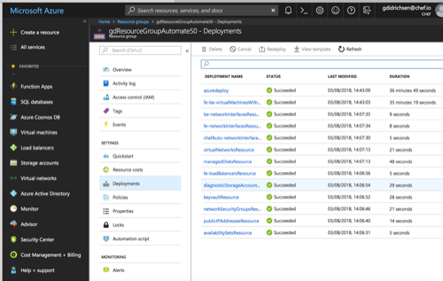

# How to deploy cluster and sample clients

## Overview of the process

In order to begin using the chef automate cluster and to wire in clients there are a number of high level features that should be understood first.

The following points and diagram refer to the deployment of the chef-automate-ha cluster:

- (1) Deploy the chef-automate-ha cluster.  During the deployment all restricted information like credentials and private keys are stored in a key vault.  Other information like the chefserver username and public DNS are published at the end of a successful deployment in the outputs section of the deployment summary JSON.
- (2a) Log onto azure after a successful deployment of the cluster and get all required infomation:  Query the Key Vault for the credentials and private keys.  Query the azure resource group, in which the cluster is deployed, to get all deployment outputs.
- (2b) Store locally all the credentials, private keys, and output information.  All of these will be required for the next stage, wiring in client nodes.


The following points and diagram refer to the wiring in of client nodes:

- (3) Deploy the client(s) to a different azure resource group.
- (4a) Initialize knife so that it can query the chefserver regarding client nodes, upload cookbooks.
- (4b) Use knife to bootstrap the client(s).


## Overview of the directory structure

- At the top level is the chef-automate-ha ARM deployment templates.  
- This document is ./scripts/deploy/README.md
- Beneath ./scripts/deploy is all the code that automates the deployment of the cluster, the configuration of knife, and the setup of a sample chef client node. This will be explained in a later section.

```bash
.
├── azuredeploy.json
├── azuredeploy.parameters.json
├── nested
└── scripts
    └── deploy
        ├── README.md
        ├── src
        │   ├── clients
        │   │   ├── arm
        │   │   │   ├── azuredeploy.json
        │   │   │   ├── azuredeploy.parameters.json
        │   │   │   └── metadata.json
        │   │   ├── deploy.sh
        │   │   └── get_output.sh
        │   ├── cluster
        │   │   ├── deploy.sh
        │   │   ├── get_output.sh
        │   │   └── input
        │   │       └── args.json.sample
        │   └── knife
        │       ├── connectClientsToChefServer.sh
        │       └── cookiecutter-knife
        │           ├── cookiecutter.json.template
        │           └── {{cookiecutter.dir_name}}
        │               ├── .chef
        │               │   └── knife.rb
        │               ├── cookbooks
        │               │   └── starter
        │               ├── doKnifeBootstrap.sh
        │               └── test_doKnifeBootstrap.sh

```

## Pre-requisite software

The following software must be installed on your workstation, the computer from which you will be running all deployments:

- [Azure CLI](https://docs.microsoft.com/en-us/cli/azure/install-azure-cli?view=azure-cli-latest)
- [JQ](https://github.com/stedolan/jq/wiki/Installation)
- [Cookiecutter](http://cookiecutter.readthedocs.io/en/latest/installation.html) 

## Walk Through a Deployment

In a terminal setup some initial variables that will be used throughout the deployment:

- $SCRIPT_SRC will refer to ./scripts/deploy/src directory
- $AZURE_RESOURCE_GROUP_FOR_AUTOMATE will refer to the name of the cluster's resource group, e.g., gdResourceGroupAutomate50
- $AZURE_RESOURCE_GROUP_FOR_CLIENT will refer to the name of the client's resource group, e.g., gdResourceGroupClient50

For example:

```bash
export SCRIPT_SRC=<PATH_TO_CHEF_AUTOMATE_HA>/scripts/deploy/src
export AZURE_RESOURCE_GROUP_FOR_AUTOMATE=gdResourceGroupAutomate50
export AZURE_RESOURCE_GROUP_FOR_CLIENT=gdResourceGroupClient50
```

### Setup the initial JSON file with required inputs

```bash
cd $SCRIPTS_SRC/cluster/input
cp args.json.sample args.json
```

Edit the args.json file noting:

- **baseUrl** is the url for the chef-automate-ha repository. (The link below is correct for now as this code is temporarily on a branch)
- **appID**, **objectId**, **password**, and **tennantID** are all the values obtain from your existing service principal or the one you created earlier.
- **ownerEmail** and **ownerName** are used to tag the azure resource group

```json
{
  "adminUsername": "azureuser",
  "appID": "52e3d1d9-xxxx-yyyy-zzzz-2a5447b55469",
  "baseUrl": "https://raw.githubusercontent.com/chef-partners/chef-automate-ha/add_test_nodes_dev/",
  "objectId": "f9842bdf-xxxx-yyyy-zzzz-cfc8366b35b8",
  "organizationName": "chefserverorganization",
  "ownerEmail": "bob@company.com",
  "ownerName": "bob",
  "password": "508ed8bf-xxxx-yyyy-zzzz-101a08ae5547",
  "tenantID": "a2b2d7bc-xxxx-yyyy-zzzz-f98a7ac416d7"
}
```

### Deploy the cluster

```bash
cd $SCRIPTS_SRC/cluster
./deploy.sh --resource-group $AZURE_RESOURCE_GROUP_FOR_AUTOMATE
```

This script:

- populates the ARM parameter file ./test.parameters.json, which is a copy of the ./azuredeploy.parameters.json
- creates a new azure resource group $AZURE_RESOURCE_GROUP_FOR_AUTOMATE.
- deploys the ./azuredeploy.json ARM template, which installs the chef-automate-ha cluster
- produces output that looks something like:

```bash
➜  cluster git:(add_test_nodes_dev) ./deploy.sh --resource-group gdResourceGroupAutomate50
[2018-08-03_14:06:14.2N] [INFO]    Executing /Users/gavindidrichsen/Documents/DUMP/chef-automate-ha/scripts/deploy/src/cluster/deploy.sh
[2018-08-03_14:06:14.2N] [INFO]    Reading JSON vars from /Users/gavindidrichsen/Documents/DUMP/chef-automate-ha/scripts/deploy/src/cluster/input/args.json:
...
}
[2018-08-03_14:06:14.2N] [INFO]    Evaluating the following bash variables:
...
[2018-08-03_14:06:14.2N] [INFO]    Creating the following group
az group create --location ukwest --resource-group gdResourceGroupAutomate50 --tags OwnerName=bob Owner=bob@company.com InUse=False
{
  "id": "/subscriptions/1e0b427a-d58b-494e-ae4f-ee558463ebbf/resourceGroups/gdResourceGroupAutomate50",
  "location": "ukwest",
  "managedBy": null,
  "name": "gdResourceGroupAutomate50",
  "properties": {
    "provisioningState": "Succeeded"
  },
  "tags": {
    "InUse": "False",
    "Owner": "bob@company.com",
    "OwnerName": "bob"
  }
}
[2018-08-03_14:06:17.2N] [INFO]    Starting the azure deployment
az group deployment create --template-file /Users/gavindidrichsen/Documents/DUMP/chef-automate-ha/azuredeploy.json --parameters /Users/gavindidrichsen/Documents/DUMP/chef-automate-ha/test.parameters.json --resource-group gdResourceGroupAutomate50 --no-wait
[2018-08-03_14:06:19.2N] [INFO]    Exiting /Users/gavindidrichsen/Documents/DUMP/chef-automate-ha/scripts/deploy/src/cluster/deploy.sh cleanly with exit code [0]
➜  cluster git:(add_test_nodes_dev)
```

Log onto the Azure portal to confirm a successful deployment.  Don't proceed until the deployment is complete. A succesfully completed deployment will take 30+ minutes and look something like this:



Only after the chef-automate-ha has successfully deployed, then go onto the next step and get outputs and private keys from the deployment.

### Get the cluster deployment outputs

```bash
cd $SCRIPTS_SRC/cluster
./get_output.sh --resource-group $AZURE_RESOURCE_GROUP_FOR_AUTOMATE
```

This script:

- logs into azure using the service principal credentials.
- writes the deployment output summary to $SCRIPTS/cluster/output/args.json.
- downloads the chefserver private keys from the azure Key Vault: the USER.pem and the ORGANIZATION-validator.pem
- produces a number of files beneath $SCRIPT_SRC/cluster/output that are used for later activities like setting up knife.

```bash
➜  cluster git:(add_test_nodes_dev) tree $SCRIPT_SRC/cluster/output
/Users/gavindidrichsen/Documents/DUMP/chef-automate-ha/scripts/deploy/src/cluster/output
├── args.json
├── delivery.pem
└── walmart-validator.pem

0 directories, 3 files
➜  cluster git:(add_test_nodes_dev)
```

### Connect knife to the chefserver

```bash
cd $SCRIPTS_SRC/knife
./connectKnifeToChefServer.sh
```

This script:

- copies from $SCRIPTS/cluster/output the cluster output summary args.json and the chefserver private keys.
- creates a knife directory structure like below:

```bash
➜  knife git:(add_test_nodes_dev) ✗ cd $SCRIPT_SRC/knife/bootstrapper/$AZURE_RESOURCE_GROUP_FOR_AUTOMATE
➜  gdResourceGroupAutomate50 git:(add_test_nodes_dev) ✗ tree -a .
├── .chef
│   ├── delivery.pem
│   ├── knife.rb
│   └── walmart-validator.pem
├── .gitignore
├── cookbooks
│   ├── chefignore
│   └── starter
│       ├── attributes
│       │   └── default.rb
│       ├── files
│       │   └── default
│       │       └── sample.txt
│       ├── metadata.rb
│       ├── recipes
│       │   └── default.rb
│       └── templates
│           └── default
│               └── sample.erb
├── doKnifeBootstrap.sh
└── test_doKnifeBootstrap.sh
```

- configures the $SCRIPT_SRC/knife/bootstrap/chef/knife.rb, connects to the chefserver, uploads the simple "starter" cookbook, which is used later to validate that the clients have connected, and produces output like the following:

```bash
➜  knife git:(add_test_nodes_dev) ./connectKnifeToChefServer.sh
...
...
[2018-08-03_16:42:36.2N] [INFO]    bootstrapping knife
WARNING: Certificates from chefservere65.ukwest.cloudapp.azure.com will be fetched and placed in your trusted_cert
directory (/Users/gavindidrichsen/Documents/DUMP/chef-automate-ha/scripts/deploy/src/knife/bootstrapper/gdResourceGroupAutomate50/.chef/trusted_certs).

Knife has no means to verify these are the correct certificates. You should
verify the authenticity of these certificates after downloading.

Adding certificate for chefservere65_ukwest_cloudapp_azure_com in /Users/gavindidrichsen/Documents/DUMP/chef-automate-ha/scripts/deploy/src/knife/bootstrapper/gdResourceGroupAutomate50/.chef/trusted_certs/chefservere65_ukwest_cloudapp_azure_com.crt
Connecting to host chefservere65.ukwest.cloudapp.azure.com:443
Successfully verified certificates from `chefservere65.ukwest.cloudapp.azure.com'
Uploading starter      [1.0.0]
Uploaded 1 cookbook.
[2018-08-03_16:42:43.2N] [INFO]    Exiting /Users/gavindidrichsen/Documents/DUMP/chef-automate-ha/scripts/deploy/src/knife/connectKnifeToChefServer.sh cleanly with exit code [0]
➜  knife git:(add_test_nodes_dev) 
```

Manually validate that knife is connected with "knife client list" and "knife cookbook list".  There should only be one client list entry and one cookbook called "starter".  For example:

```bash
➜  src git:(add_test_nodes_dev) ✗ cd $SCRIPTS_SRC/knife/bootstrapper/$AZURE_RESOURCE_GROUP_FOR_AUTOMATE
➜  src git:(add_test_nodes_dev) ✗ knife node list
➜  src git:(add_test_nodes_dev) ✗ knife cookbook list
starter   1.0.0
➜  src git:(add_test_nodes_dev) ✗
```

Note:

- The node list is empty because at this stage there is no client connected to the chef server
- Only one chef cookbook "starter 1.0.0" is uploaded to the chefserver.  This has been added in order to validate the client connection in a later section.

### Deploy the test client

```bash
cd $SCRIPTS_SRC/clients
./deploy.sh --resource-group $AZURE_RESOURCE_GROUP_FOR_CLIENT
```

This script:

- populates the ARM parameter file $SCRIPTS_SRC/clients/arm/test.parameters.json, which is a copy of the $SCRIPTS_SRC/clients/arm/azuredeploy.parameters.json
- creates a new azure resource group $AZURE_RESOURCE_GROUP_FOR_CLIENT.
- deploys the $SCRIPTS_SRC/clients/arm/azuredeploy.json ARM template, which installs a single client node.
- produces output like the following

```bash
➜  clients git:(add_test_nodes_dev) ✗ ./deploy.sh --resource-group gdResourceGroupClient50
[2018-08-03_18:12:20.2N] [INFO]    Executing /Users/gavindidrichsen/Documents/DUMP/chef-automate-ha/scripts/deploy/src/clients/deploy.sh
[2018-08-03_18:12:20.2N] [INFO]    Reading JSON vars from /Users/gavindidrichsen/Documents/DUMP/chef-automate-ha/scripts/deploy/src/clients/../cluster/input/args.json:
...
...
[2018-08-03_18:12:23.2N] [INFO]    Starting the azure deployment
az group deployment create --template-file /Users/gavindidrichsen/Documents/DUMP/chef-automate-ha/scripts/deploy/src/clients/arm/azuredeploy.json --parameters /Users/gavindidrichsen/Documents/DUMP/chef-automate-ha/scripts/deploy/src/clients/arm/test.parameters.json --resource-group gdResourceGroupClient50 --no-wait
[2018-08-03_18:12:27.2N] [INFO]    Exiting /Users/gavindidrichsen/Documents/DUMP/chef-automate-ha/scripts/deploy/src/clients/deploy.sh cleanly with exit code [0]
➜  clients git:(add_test_nodes_dev)
```

Log onto the Azure portal to confirm a successful deployment.  

Only after the client has successfully deployed, then go onto the next step and get outputs.

### Get the outputs from the client

```bash
cd $SCRIPTS_SRC/clients
./get_output.sh --resource-group $AZURE_RESOURCE_GROUP_FOR_CLIENT
```

This script:

- re-uses the $SCRIPTS_SRC/cluster/input/args.json as input
- logs into azure using the service principal credentials.
- writes the client deployment output summary to $SCRIPTS_SRC/clients/output/args.json.  Note 2 key values in the args.json output that must be used to bootstrap the client to the chefserver: (1) the "sshClientUser", which is the CLIENT_USERNAME and (2) the "sshClientDns", which is the public DNS for the client

```bash
➜  clients git:(add_test_nodes_dev) ✗ cd $SCRIPTS_SRC/clients
➜  clients git:(add_test_nodes_dev) ✗ tree output
output
└── args.json

0 directories, 1 file
➜  clients git:(add_test_nodes_dev) ✗ cat output/args.json | jq '.'
{
  "adminUsername": "didricg",
  "appID": "yyyyyyy",
  "azureResourceGroupForChefServer": "gdResourceGroupAutomate50",
  "azureResourceGroupForClients": "gdResourceGroupClient50",
  "baseUrl": "https://raw.githubusercontent.com/chef-partners/chef-automate-ha/add_test_nodes_dev/",
  "chefAutomateFqdn": "chefautomatee65.ukwest.cloudapp.azure.com",
  "chefAutomatePassword": "yyyyyyy",
  "chefAutomateUrl": "https://chefautomatee65.ukwest.cloudapp.azure.com",
  "chefAutomateUsername": "admin",
  "chefServerFqdn": "chefservere65.ukwest.cloudapp.azure.com",
  "chefServerUrl": "https://chefservere65.ukwest.cloudapp.azure.com",
  "chefServerWebLoginPassword": "yyyyyyy",
  "chefServerWebLoginUserName": "delivery",
  "keyvaultName": "chef-keye65n7",
  "objectId": "yyyyyyy",
  "organizationName": "walmart",
  "ownerEmail": "bob@company.com",
  "ownerName": "bob",
  "password": "yyyyyyy",
  "sshClientDns": "storexj26gkqjyi64q.ukwest.cloudapp.azure.com",
  "sshClientUser": "didricg",
  "tenantID": "yyyyyyy"
}
➜  clients git:(add_test_nodes_dev) ✗
```

Get the CLIENT_IP from the sshClientDns by using "dig", for example:

```bash
➜  clients git:(add_test_nodes_dev) ✗ dig +short storexj26gkqjyi64q.ukwest.cloudapp.azure.com
51.141.112.62
```

Now, given values for $CLIENT_IP and $CLIENT_USER, go onto the next stage

### Bootstrap the client to the chefserver

```bash
cd $SCRIPTS_SRC/clients
./bootstrap.sh
```

This script:

- gets the CLIENT_IP and CLIENT_USERNAME for the client node
- calls the \$SCRIPT_SRC/knife/bootstrapper/$AZURE_RESOURCE_GROUP_FOR_AUTOMATE/doKnifeBootstrap.sh which in turn builds the knife bootstrap statement and then runs it.
- produces output like the following:

```bash
➜  clients git:(add_test_nodes_dev) ✗ ./bootstrap.sh
[2018-08-03_20:18:28.2N] [INFO]    Executing /Users/gavindidrichsen/Documents/DUMP/chef-automate-ha/scripts/deploy/src/clients/bootstrap.sh
...
...
[2018-08-03_20:18:29.2N] [INFO]    yes | ./doKnifeBootstrap.sh --client-ip 51.141.112.62 --client-user didricg
[2018-08-03_20:18:29.2N] [INFO]    Executing /Users/gavindidrichsen/Documents/DUMP/chef-automate-ha/scripts/deploy/src/knife/bootstrapper/gdResourceGroupAutomate50/doKnifeBootstrap.sh
[2018-08-03_20:18:30.2N] [INFO]    Running the following command [yes | knife bootstrap 51.141.112.62 --node-ssl-verify-mode none --verbose --ssh-user didricg --sudo --node-name sshvm.ygvbfzpmm3hubmsidufczaidjg.cwx.internal.cloudapp.net --run-list 'recipe[starter]' --json-attributes '{"cloud":{"public_ip":"51.141.112.62"}}']
INFO: Using configuration from /Users/gavindidrichsen/Documents/DUMP/chef-automate-ha/scripts/deploy/src/knife/bootstrapper/gdResourceGroupAutomate50/.chef/knife.rb
Node sshvm.ygvbfzpmm3hubmsidufczaidjg.cwx.internal.cloudapp.net exists, overwrite it? (Y/N) Client sshvm.ygvbfzpmm3hubmsidufczaidjg.cwx.internal.cloudapp.net exists, overwrite it? (Y/N) Creating new client for sshvm.ygvbfzpmm3hubmsidufczaidjg.cwx.internal.cloudapp.net
Creating new node for sshvm.ygvbfzpmm3hubmsidufczaidjg.cwx.internal.cloudapp.net
Connecting to 51.141.112.62
51.141.112.62 -----> Existing Chef installation detected
51.141.112.62 Starting the first Chef Client run...
51.141.112.62 Starting Chef Client, version 13.10.0
51.141.112.62 resolving cookbooks for run list: ["starter"]
51.141.112.62 Synchronizing Cookbooks:
51.141.112.62   - starter (1.0.0)
51.141.112.62 Installing Cookbook Gems:
51.141.112.62 Compiling Cookbooks...
51.141.112.62 Converging 1 resources
51.141.112.62 Recipe: starter::default
51.141.112.62   * log[Welcome to Chef, Sam Doe!] action write
51.141.112.62
51.141.112.62
51.141.112.62 Running handlers:
51.141.112.62 Running handlers complete
51.141.112.62 Chef Client finished, 1/1 resources updated in 01 seconds
[2018-08-03_20:18:37.2N] [INFO]    Exiting /Users/gavindidrichsen/Documents/@REFERENCE/azure/scripts/arm/chef-automate-ha/scripts/deploy/src/knife/bootstrapper/gdResourceGroupAutomate50/doKnifeBootstrap.sh cleanly with exit code [0]
[2018-08-03_20:18:37.2N] [INFO]    Exiting /Users/gavindidrichsen/Documents/@REFERENCE/azure/scripts/arm/chef-automate-ha/scripts/deploy/src/clients/bootstrapClientToChefServer.sh cleanly with exit code [0]
➜  clients git:(add_test_nodes_dev) ✗
```

The crux of the above output is the actual "knife bootstrap..." statement:

```bash
knife bootstrap 51.141.112.62 --node-ssl-verify-mode none --verbose --ssh-user didricg --sudo --node-name sshvm.ygvbfzpmm3hubmsidufczaidjg.cwx.internal.cloudapp.net --run-list 'recipe[starter]' --json-attributes '{"cloud":{"public_ip":"51.141.112.62"}}'
```

If the client ip address in this statement (e.g., 51.141.112.62) is changed to any other valid IP address, then more clients can be added manually.

Finally, use knife to verify that the chefserver indeed has a new client connected:

```bash
cd $SCRIPT_SRC/knife/bootstrapper/$AZURE_RESOURCE_GROUP_FOR_AUTOMATE
knife node list
```

This will produce output something like the following.  Notice 2 entries now, one which is the private hostname fqdn of the new client:

```bash
➜  src git:(add_test_nodes_dev) ✗ cd $SCRIPT_SRC/knife/bootstrapper/$AZURE_RESOURCE_GROUP_FOR_AUTOMATE
➜  gdResourceGroupAutomate50 git:(add_test_nodes_dev) ✗ knife client list
sshvm.ygvbfzpmm3hubmsidufczaidjg.cwx.internal.cloudapp.net
➜  gdResourceGroupAutomate50 git:(add_test_nodes_dev) ✗
```

## Manually Verify the Automate Cluster is Working

Manually verify that the automate cluster by opening a browser to the URL of the Automate frontend.  To achieve this, first get all the connection details, url, credentials, etc:

* Go to the clients directory; view the ./output/args.json; and extract the chefAutomateUrl, chefAutomateUsername, and chefAutomatePassword details.  For example:

  ```bash
  ➜  src git:(reduce_vm_size) ✗ cd $SCRIPTS_SRC/clients
  ➜  clients git:(reduce_vm_size) ✗ cat output/args.json
  {
    ...
    ...
    ...
    "chefAutomatePassword": "thisisaveryveryverylongpassword",
    "chefAutomateUrl": "https://chefautomateblah.ukwest.cloudapp.azure.com",
    "chefAutomateUsername": "admin",
    ...
    ...
    ...
  }
  ➜  clients git:(reduce_vm_size) ✗
  ```

Then open a browser at the $chefAutomateUrl and fill in the $chefAutomateUsername and $chefAutomatePassword.  
* Fill in your name and email; agree to the terms of service; and sign up
  
* Select "It's ok, I know what I'm doing"
  
* Go to "Client Runs" tab.  If all setup so far has been successful, then there will be 1 Node displayed here.  For example
  